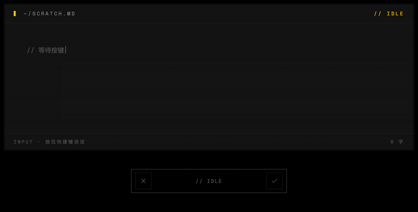

<div align="center">
  

  <h1>OpenSpeech</h1>

  <p><strong>按一下快捷键说话，文字就出现在光标所在的地方。</strong></p>

  <p>跨平台 AI 语音输入桌面应用 · Voice typing for every app.</p>

  <p>
    <a href="https://github.com/OpenLoaf/OpenSpeech/releases/latest"></a>
    <a href="LICENSE"></a>
    
  </p>

  <p>
    <strong>简体中文</strong>
    · <a href="docs/README.en.md">English</a>
    · <a href="docs/README.zh-TW.md">繁體中文</a>
  </p>
</div>

---

## 简介

OpenSpeech 是一款跨平台的桌面端语音输入工具：在任何应用、任何输入框，按一下快捷键开始说话，再按一下就把转写文字写到光标位置。Windows / macOS / Linux 三端同步发布。

**说一段大白话，落到光标里就是结构化文档。** 录音 → 转写 → AI 清洗，口误、语气词、自我纠错全部抹平，再按你想要的格式重排：

<p align="center">
  
</p>

## 功能

- **全局语音输入**：编辑器、浏览器、聊天窗口、终端都能直接说话转文字，无需为单独应用做适配。
- **自定义快捷键**：默认 macOS `Fn + Ctrl`、Windows `Ctrl + Win`、Linux `Ctrl + Super`，可自由更换。
- **AI 实时优化**：转写过程中自动去除 um/uh、修正口误，输出可直接使用的文字。
- **历史记录与重试**：每条转写都保存在本地，可随时查看、复制、重新转写。
- **个人字典**：维护专有名词、人名、术语，提高识别准确率。
- **多语言界面**：简体中文、English；明暗主题跟随系统。
- **托盘驻留 / 开机自启 / 应用内更新**：常规桌面应用集成。

## 截图

<p align="center">
  
</p>

## 安装

前往 [Releases](https://github.com/OpenLoaf/OpenSpeech/releases/latest) 下载对应平台安装包：

- **macOS**：`OpenSpeech_x.y.z_universal.dmg`（macOS 10.15+）
- **Windows**：`OpenSpeech_x.y.z_x64-setup.exe`
- **Linux**：`.AppImage` / `.deb` / `.rpm`

首次启动需授予麦克风权限；macOS 还需要辅助功能（Accessibility）权限。

## 路线图（To-Do）

### 已实现
- [x] SaaS 端音频转写
- [x] 实时语音转录 + AI 优化
- [x] 历史记录与重试
- [x] 字典功能

### 开发中
- [ ] 长时间录音 / 会议模式

### 待开发
多平台 STT 模型接入：

- [ ] Microsoft Azure Speech
- [ ] Google Cloud Speech-to-Text
- [ ] 腾讯云语音识别
- [ ] 阿里云语音识别
- [ ] 火山引擎（豆包）语音识别
- [ ] 科大讯飞语音识别
- [ ] OpenAI Whisper API
- [ ] Deepgram
- [ ] AssemblyAI

## 快速开始

1. 启动 OpenSpeech 并授予权限。
2. 在任意输入框点击光标。
3. 按一下快捷键开始说话——
   - macOS：`Fn + Ctrl`
   - Windows：`Ctrl + Win`
   - Linux：`Ctrl + Super`
4. 再按一下同样的快捷键结束，文字自动写入。

## 开发

技术栈：Tauri 2 · React 19 · TypeScript · Rust · Tailwind CSS 4。

```bash
git clone https://github.com/OpenLoaf/OpenSpeech.git
cd OpenSpeech
pnpm install
pnpm tauri dev
```

环境要求：Node.js ≥ 18、pnpm ≥ 9、Rust stable。平台依赖参见 [Tauri 官方先决条件](https://tauri.app/start/prerequisites/)。

## 贡献

欢迎提 Issue / Pull Request。较大改动建议先开 Issue 讨论方案。

## 许可证

[MIT](./LICENSE) © OpenLoaf
