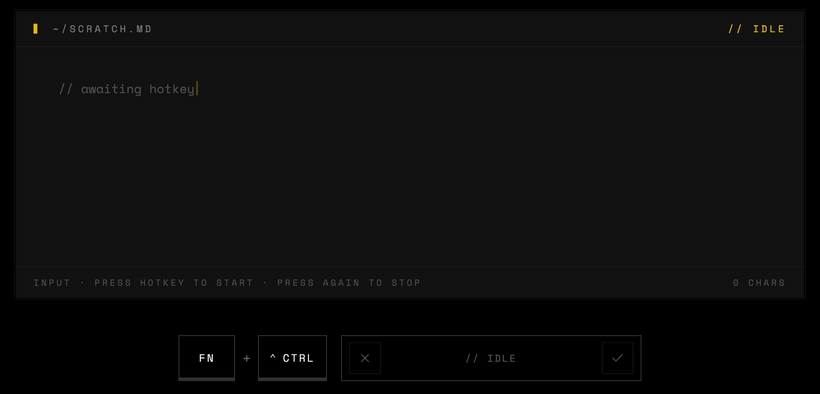
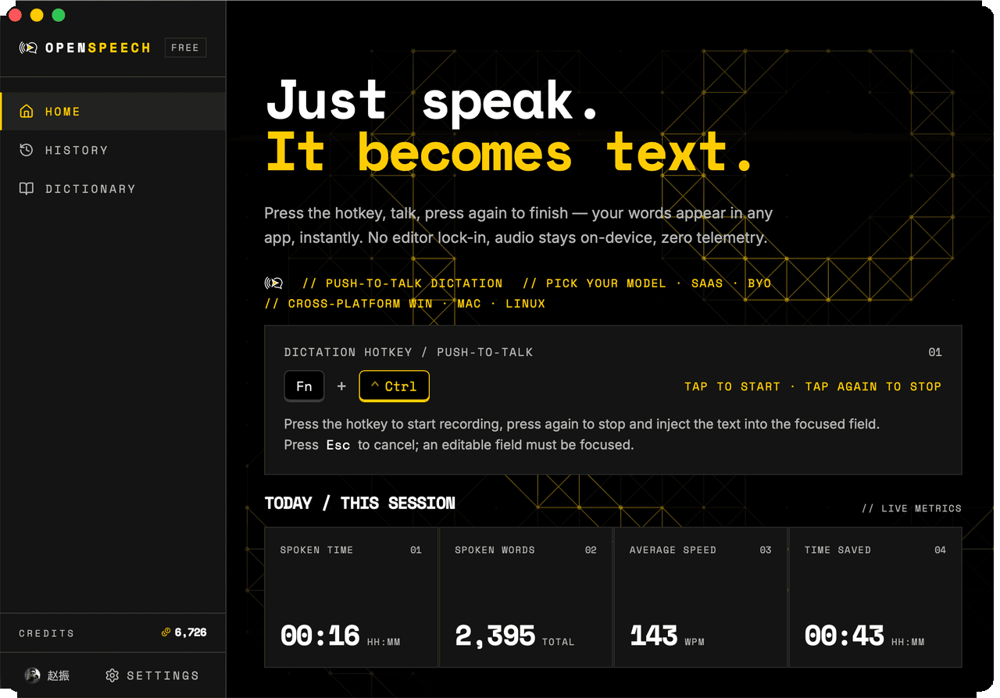

<div align="center">
  

  <h1>OpenSpeech</h1>

  <p><strong>Press a hotkey, speak, and your words appear right at the cursor.</strong></p>

  <p>Cross-platform AI voice typing for the desktop.</p>

  <p>
    <a href="https://github.com/OpenLoaf/OpenSpeech/releases/latest"></a>
    <a href="../LICENSE"></a>
    
  </p>

  <p>
    <a href="../README.md">简体中文</a>
    · <strong>English</strong>
    · <a href="README.zh-TW.md">繁體中文</a>
  </p>
</div>

---

## About

OpenSpeech is a cross-platform desktop voice typing tool. Press a hotkey in any app to start recording, press it again, and the transcribed text is written at your cursor. Released for Windows, macOS and Linux at the same time.

**Speak in plain words and the transcript lands at your cursor as a clean, structured note.** Record → transcribe → AI clean-up smooths over filler words, slips of the tongue and self-corrections, then reformats the result the way you want it:

<p align="center">
  
</p>

## Features

**Speak, and the words land at your cursor.**
Press a hotkey to start, press it again to stop. Filler words, slips of the tongue and self-corrections all get cleaned up by the AI — what lands at your cursor is the polished version, not a raw transcript. Works in VS Code, chat apps, email and terminals — anywhere you can type.

**Speak one language, write in another.**
Press the translate hotkey, say something in Chinese, and English appears at the cursor (or Japanese, Korean, French, German, Spanish, Traditional Chinese). Want both? It can give you the original alongside the translation.

**Auto-summarise meetings.**
Long recordings, automatic speaker separation, and one-click AI summaries in Markdown — decisions, action items, key discussion points all laid out for you. Survives network drops; the timeline keeps going on reconnect. Export to a file when you're done.

**It knows your field.**
Pick your domain (medicine, law, psychology, programming, design, finance — 16 in total) and the AI keeps your jargon intact instead of "translating" it into everyday words. Add a personal dictionary for names, brands, or anything else worth getting right.

**Bring your own API if you prefer.**
Plug in your Tencent Cloud, Aliyun Bailian, or any OpenAI-compatible endpoint. Credentials live in your OS keychain — they never leave your machine. If something's misconfigured, the app tells you exactly which field, and you can flip back to the cloud in one click.

**Your history and stats stay local.**
Every recording, the AI-cleaned version, and which app you were typing into — all stored on disk, ready to browse, copy, or re-transcribe. Built-in usage stats show how long you've been talking this month and where you actually use it most.

**Hotkeys are yours to set.**
Four independent shortcuts (dictate, translate, summon main window, open AI toolbox), each remappable. The app catches conflicts (like Ctrl vs. Ctrl+Shift triggering each other) and warns you about system-reserved combos.

**The usual desktop niceties.**
Tray, autostart, in-app updates, three-language UI (Simplified Chinese / English / Traditional Chinese), light/dark theme that follows your system, and you don't get logged out after sleep.

## Screenshots

<p align="center">
  
</p>

## Install

Grab the installer for your platform from [Releases](https://github.com/OpenLoaf/OpenSpeech/releases/latest):

- **macOS**: `OpenSpeech_x.y.z_universal.dmg` (macOS 10.15+)
- **Windows**: `OpenSpeech_x.y.z_x64-setup.exe`
- **Linux**: `.AppImage` / `.deb` / `.rpm`

You'll be asked to grant microphone access on first launch; macOS additionally needs Accessibility permission.

## Roadmap

### Shipped
- [x] Cloud transcription (real-time + utterance modes)
- [x] AI clean-up (filler words / slips / spoken numbers → digits)
- [x] Translate-while-dictating (8 target languages, bilingual output)
- [x] Meeting transcription (speaker separation, AI summary, Markdown export, auto-reconnect)
- [x] Domain-aware AI (16 professional domains) + personal dictionary
- [x] Customisable hotkeys (dictate / translate / summon window / open toolbox, with conflict detection)
- [x] Usage stats (monthly minutes / words / top apps / active hours)
- [x] Custom AI provider (any OpenAI-compatible endpoint)
- [x] Custom ASR providers: Tencent Cloud, Aliyun Bailian (DashScope)
- [x] History & retry / auto re-transcribe after re-login

### Planned
More STT provider integrations:

- [ ] Microsoft Azure Speech
- [ ] Google Cloud Speech-to-Text
- [ ] Volcengine (Doubao) Speech
- [ ] iFlytek Speech
- [ ] OpenAI Whisper API
- [ ] Deepgram
- [ ] AssemblyAI

## Quick start

1. Launch OpenSpeech and grant the requested permissions.
2. Click into any text input to place the cursor.
3. Press the hotkey to start talking —
   - macOS: `Fn + Ctrl`
   - Windows: `Alt + Win`
   - Linux: `Ctrl + Super`
4. Press the same hotkey again to stop. The transcription is inserted at the cursor.

## Development

Stack: Tauri 2 · React 19 · TypeScript · Rust · Tailwind CSS 4.

```bash
git clone https://github.com/OpenLoaf/OpenSpeech.git
cd OpenSpeech
pnpm install
pnpm tauri dev
```

Requirements: Node.js ≥ 18, pnpm ≥ 9, Rust stable. See the [Tauri prerequisites](https://tauri.app/start/prerequisites/) for platform-specific dependencies.

## Contributing

Issues and pull requests are welcome. For non-trivial changes, please open an issue first to discuss the approach.

## License

[PolyForm Noncommercial 1.0.0](../LICENSE) © OpenLoaf

Free to use, modify, and distribute for **noncommercial purposes** — personal use, research, education, and noncommercial organizations. For commercial licensing (including using this project in commercial products, SaaS services, or closed-source distribution), please contact the author for a separate license.
