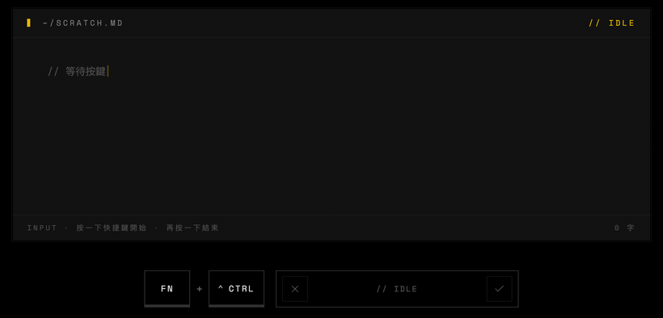

<div align="center">
  

  <h1>OpenSpeech</h1>

  <p><strong>按一下快捷鍵說話，文字就出現在游標所在的地方。</strong></p>

  <p>跨平台 AI 語音輸入桌面應用 · Voice typing for every app.</p>

  <p>
    <a href="https://github.com/OpenLoaf/OpenSpeech/releases/latest"></a>
    <a href="../LICENSE"></a>
    
  </p>

  <p>
    <a href="../README.md">简体中文</a>
    · <a href="README.en.md">English</a>
    · <strong>繁體中文</strong>
  </p>
</div>

---

## 簡介

OpenSpeech 是一款跨平台的桌面端語音輸入工具：在任何應用、任何輸入框，按一下快捷鍵開始說話，再按一下就把轉寫文字寫到游標位置。Windows / macOS / Linux 三端同步發佈。

**說一段大白話，落到游標裡就是結構化文件。** 錄音 → 轉寫 → AI 清洗，口誤、語氣詞、自我糾錯全部抹平，再按你想要的格式重排：

<p align="center">
  
</p>

## 功能

- **全域語音輸入**：編輯器、瀏覽器、聊天視窗、終端機都能直接說話轉文字，不需為個別應用做適配。
- **自訂快捷鍵**：預設 macOS `Fn + Ctrl`、Windows `Ctrl + Win`、Linux `Ctrl + Super`，可自由更換。
- **AI 即時優化**：轉寫過程中自動去除 um/uh、修正口誤，輸出可直接使用的文字。
- **BYOK 自訂供應商**：音訊（ASR）和 AI 都可自填 endpoint / key / model，憑證存系統鑰匙圈，不上送伺服器。目前內建適配 **騰訊雲 ASR**、**阿里百煉（DashScope）ASR**；AI 端相容任意 OpenAI 協定端點。
- **歷史紀錄與重試**：每筆轉寫都保存在本機，可隨時檢視、複製、重新轉寫。
- **個人字典**：維護專有名詞、人名、術語，提高辨識準確率。
- **多語言介面**：簡體中文、English；明暗主題跟隨系統。
- **常駐工具列 / 開機自動啟動 / 應用程式內更新**：常規桌面應用整合。

## 截圖

<p align="center">
  
</p>

## 安裝

前往 [Releases](https://github.com/OpenLoaf/OpenSpeech/releases/latest) 下載對應平台安裝包：

- **macOS**：`OpenSpeech_x.y.z_universal.dmg`（macOS 10.15+）
- **Windows**：`OpenSpeech_x.y.z_x64-setup.exe`
- **Linux**：`.AppImage` / `.deb` / `.rpm`

首次啟動需授予麥克風權限；macOS 還需要輔助使用（Accessibility）權限。

## 路線圖（To-Do）

### 已實現
- [x] SaaS 端音訊轉寫
- [x] 即時語音轉錄 + AI 優化
- [x] 歷史紀錄與重試
- [x] 字典功能
- [x] 自訂 AI 供應商（相容 OpenAI 協定端點）
- [x] 自訂 ASR 供應商：騰訊雲
- [x] 自訂 ASR 供應商：阿里百煉（DashScope）

### 開發中
- [ ] 會議轉錄（長時間錄音 / 會議模式）

### 待開發
更多 STT 供應商接入：

- [ ] Microsoft Azure Speech
- [ ] Google Cloud Speech-to-Text
- [ ] 火山引擎（豆包）語音識別
- [ ] 科大訊飛語音識別
- [ ] OpenAI Whisper API
- [ ] Deepgram
- [ ] AssemblyAI

## 快速上手

1. 啟動 OpenSpeech 並授予權限。
2. 在任意輸入框點擊游標。
3. 按一下快捷鍵開始說話——
   - macOS：`Fn + Ctrl`
   - Windows：`Ctrl + Win`
   - Linux：`Ctrl + Super`
4. 再按一下同樣的快捷鍵結束，文字自動寫入。

## 開發

技術棧：Tauri 2 · React 19 · TypeScript · Rust · Tailwind CSS 4。

```bash
git clone https://github.com/OpenLoaf/OpenSpeech.git
cd OpenSpeech
pnpm install
pnpm tauri dev
```

環境需求：Node.js ≥ 18、pnpm ≥ 9、Rust stable。平台相依套件請參閱 [Tauri 官方先決條件](https://tauri.app/start/prerequisites/)。

## 貢獻

歡迎提 Issue / Pull Request。較大的改動建議先開 Issue 討論方案。

## 授權

[PolyForm Noncommercial 1.0.0](../LICENSE) © OpenLoaf

個人、研究、教育、非營利組織等**非商業用途**可自由使用、修改和散布。如需商業授權（包含但不限於將本專案用於商業產品、SaaS 服務或閉源散布），請聯絡作者取得單獨授權。
